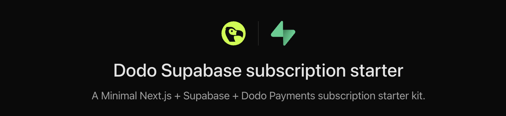

# Dodo Supabase Subscription Starter



A **minimal subscription starter kit** built with **Next.js**, **Supabase**, and **Dodo Payments**.
This boilerplate helps you quickly set up a subscription-based SaaS with authentication, payments, and webhooks.

---

## 🚀 Features

- 🔑 Supabase google authentication
- 💳 Payment & Subscription management with Dodo Payments
- 📡 Webhook support for subscription lifecycle events via supabase functions

---

## 📦 Getting Started

### 1. Create a Supabase Project

Go to [Supabase](https://app.supabase.com) and create a new project. Copy the **Project URL** and **Anon Key** from your project settings → API section. These will be used in your environment variables. Then, enable Google OAuth by adding the OAuth client ID and secret from the Google Cloud Console.

### 2. Install dependencies

```bash
bun i
# or
npm install
# or
pnpm install
```

### 3. Configure environment variables

Copy `.env.example` to `.env.local` and fill in your values:

```env
NEXT_PUBLIC_SUPABASE_URL=
NEXT_PUBLIC_SUPABASE_ANON_KEY=
DATABASE_URL=
DODO_PAYMENTS_API_KEY=
DODO_WEBHOOK_SECRET=
DODO_PAYMENTS_ENVIRONMENT= # "test_mode" or "live_mode"
```

### 4. Push database schema

```bash
bun db:push
# or
npm run db:push
# or
pnpm db:push
```

### 5. Deploy Supabase function (for handling webhooks)

```bash
bun deploy:webhook --project-ref [projectId]
# or
npm run deploy:webhook -- --project-ref [projectId]
# or
pnpm deploy:webhook --project-ref [projectId]
```

### 6. Add webhook in Dodo Payments

In your **Dodo Payments dashboard**, configure the webhook URL pointing to your deployed Supabase function.

---

## ▲ Deploy with Vercel

You can deploy this project instantly using the button below:

[](https://vercel.com/new/clone?repository-url=https://github.com/darshansrc/dodo-supabase-subscription-starter&env=NEXT_PUBLIC_SUPABASE_URL,NEXT_PUBLIC_SUPABASE_ANON_KEY,DATABASE_URL,DODO_PAYMENTS_API_KEY,DODO_WEBHOOK_SECRET,DODO_PAYMENTS_ENVIRONMENT)

---

## 📚 Documentation

- [Supabase Docs](https://supabase.com/docs)
- [Next.js Docs](https://nextjs.org/docs)
- [Dodo Payments Docs](https://docs.dodopayments.com)

---

## 🛠 Tech Stack

```yaml
- Next.js: https://nextjs.org/
- Supabase: https://supabase.com/
- Dodo Payments: https://dodopayments.com/
```
